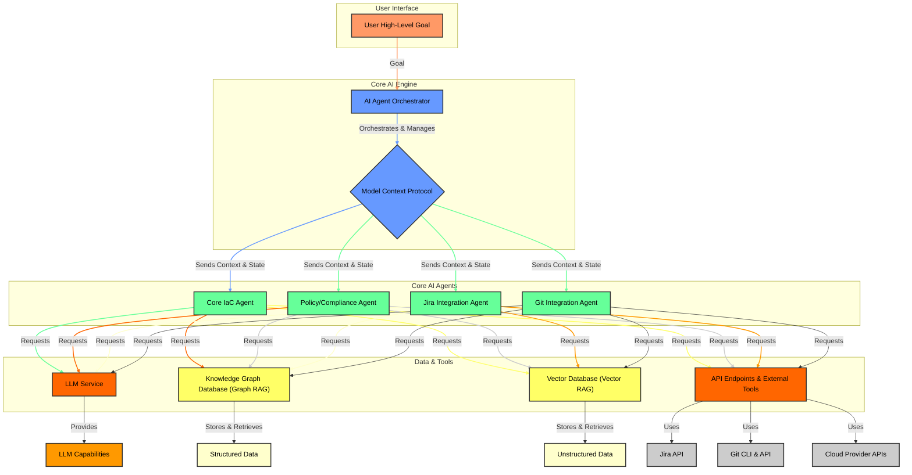

# waikao-opensource

Waikao Open Source is an open-source project dedicated to providing high-quality software solutions for various applications. Our mission is to foster innovation and collaboration within the developer community by offering accessible and reliable tools.

### WaiKao MCP Server
The Model Context Protocol (MCP) Server is a lightweight, self-hosted solution for providing long-term memory and context to AI agents, enabling complex, multi-step tasks in DevOps and beyond.

### 💡 About the Project
In the world of AI, Large Language Models (LLMs) are powerful but lack a fundamental ability: long-term memory. The WaiKao MCP Server solves this by acting as a persistent knowledge base for AI agents. It stores, retrieves, and updates an agent's context, state, and conversational history across different sessions, turning short-lived interactions into a continuous, intelligent workflow.

This server is the core of a sophisticated Agentic AI system. It forms the backbone of a Retrieval-Augmented Generation (RAG) architecture, allowing agents to retrieve factual information from a secure, persistent source before generating a response or taking action.

This project is open-source and designed for the DevOps community, with a focus on simplicity, security, and scalability.

## Proposed Core Architecture
The goal of this project is to provide an open-source for users to spin up the Platform related Cloud based infrastructure and leveraging AI for futuristic capabilities.
* The proposed architecture is designed to be modular, scalable, and extensible, allowing for easy integration of new features and capabilities over time.
* After the initial release of the MCP Server, we plan to introduce additional AI agents and functionalities in subsequent phases.
* The final product will provision cloud-based infrastructure based on the user's high-level goals and integrate seamlessly with tools such as Jira (for sprint planning) and Git (for pull requests and version control), ensuring a streamlined user experience.

This is an on-going project and divided into few phases. As a part of Phase 1 release, we are releasing the MCP Server (**Model Context Protocol**) along with the proposed future architecture releases.

## Proposed Architecture


**(The WaiKao MCP Server is the brain of a multi-component system, designed to enable Agentic AI capabilities. The architecture is modular and scalable, allowing for the integration of various specialized agents and databases.)**

## WaiKao Model Context Protocol (MCP) Server
WaiKao MCP Server is an open-source, scalable backend designed to provide AI agents with a persistent, organized, and shareable long-term memory. It acts as a central hub for agent state, enabling complex, multi-step tasks and collaborative workflows that are not possible with simple conversational history.

This repository contains the core server architecture, a complete guide on deployment, and a roadmap for future development.

🏗️ **Core Architecture**
* The server's design is focused on simplicity, scalability, and security. The entire system is built around a powerful, modular stack that you can deploy with a single command.

* **API Framework (Flask)**: The server is built with Flask, a lightweight Python web framework. It provides a clean REST API for agents to interact with their project contexts.
* **Authentication & Data (Firebase & Firestore**): The project's persistence layer is powered by Google's Firebase platform, an excellent choice for a scalable, cloud-native application.
  * **Firestore**: A NoSQL database that stores all project contexts. Its real-time capabilities are ideal for concurrent agent tasks.
  * **Firebase Authentication**: Provides secure user authentication, which ensures that project data is tied to a specific user and kept private by default.

🧠 **AI Agents & RAG Integration**

The WaiKao MCP Server is designed to empower AI agents through a **Retrieval-Augmented Generation (RAG)** architecture. Instead of just a stateless chatbot, an AI agent can use the MCP server as its **long-term memory and knowledge base**. This enables agents to perform tasks that require complex, multi-step reasoning and access to external, up-to-date information.

**How it works**:
* **The Context is the Knowledge**: An AI agent can ingest and store information—like a project plan, a market analysis, or a conversation history—into a project context using the `update_context` endpoint. This information becomes part of the agent's persistent memory.

* **Grounded Responses**: When a user asks a new question, the agent first queries its MCP context using `get_context` to retrieve relevant information. It then uses this retrieved, grounded data to formulate a more accurate and specific response. This prevents agents from "hallucinating" or providing outdated information.

* **Collaborative Memory**: Since the context is persistent and tied to a project ID, multiple agents can work on the same task, all accessing and updating a shared memory.

### 🚀 Phase 1 Release: MVP'

The initial release focuses on a Minimum Viable Product (MVP) with all the essential features for a single-user agent memory system. This is a fully functional, production-ready server that you can start building upon immediately.

1. **The MCP Server Application** (`mcp-server-firebase.py`)

* This is the main server logic, written in Python with the Flask framework. It uses the firebase_admin SDK to handle user authentication and manage projects and their contexts in a Firestore database. The code is heavily commented to explain each function's purpose and how it interacts with the database.
* This is the heart of the project, containing the Flask application logic and the direct integration with Firebase and Firestore. The code handles user authentication, CRUD operations for projects, and the core context management for your agents.

### 🚀 Getting Started
To get the WaiKao MCP Server running on your local machine, follow these steps.

**Step 1: Set up a Firebase Project**
1. Go to the Firebase Console and click "Add project". Follow the steps to create a new project.
2. Navigate to Project settings > Service accounts.
3. Click "Generate new private key". This will download a JSON file containing your Firebase credentials.
4. Important: Keep this file secure. Do not commit it to your GitHub repository.

**Step 2: Configure Firestore Security Rules**

This step is critical for securing your data. Firestore security rules control who can access and modify your database. The rules below ensure that each user can only read and write to their own project data, keeping it private and secure.
1. In your Firebase Console, navigate to the Firestore Database section.
2. Select the "Rules" tab.
3. Replace the default rules with the following code and click "Publish":

```bash
rules_version = '2';
service cloud.firestore {
match /databases/{database}/documents {
// This rule ensures that a user can only access data within their own collection.
// The userId variable is dynamically populated from the authenticated user's ID.
match /users/{userId}/{document=**} {
allow read, write: if request.auth != null && request.auth.uid == userId;
      }
   }
}
```

**Step 3: Configure the Server**

Since this is an open-source project, we need to handle credentials securely. The best practice is to use a .env file to store your credentials as environment variables.
1. Create a file named .env in the root of the project directory.
2. Copy the contents of the downloaded JSON key file and paste it as a single line for the FIREBASE_CREDENTIALS variable.
3. Add the following line to your .env file, replacing the placeholder with your actual JSON content:

```bash
# .env file
FIREBASE_CREDENTIALS='{"type": "service_account", "project_id": "your-project-id", "private_key_id": "your-private-key-id", ...}'
---
```
Make sure to replace the placeholder with the actual JSON content from your Firebase service account key file. Ensure that the entire JSON is on a single line and properly escaped if necessary.

**Step 4: Install Docker and Docker Compose**

Make sure you have Docker and Docker Compose installed on your machine. You can download them from the official Docker website.

**Step 5: Run the Server with Docker Compose**
1. Clone the repository and navigate into the directory:
``git clone https://github.com/vikram-yerneni/waikao-opensource.git``

``cd waikao-mcp-server``

2. Build and run the server using Docker Compose. The `docker-compose.yml` file will automatically read your `.env` file.
``docker-compose up --build``
3. Your server should now be running locally at `http://localhost:5000`.

**Step 6: Test the API**
You can use tools like Postman or curl to test the API endpoints. Make sure to include the Firebase authentication token in your requests.

### 📚 API Endpoints
The MCP server provides the following REST API endpoints:

| Endpoint               | Method | Description                                      | Request Body Example                                      |
|------------------------|--------|--------------------------------------------------|-----------------------------------------------------------|
| `/create_project`      | POST   | Create a new project for the authenticated user. | `{ "project_id": "project123" }`                          |
| `/get_project/<project_id>` | GET    | Retrieve details of a specific project.          | N/A                                                       |
| `/update_context/<project_id>` | POST   | Update the context for a specific project.       | `{ "context": "This is the updated context information." }` |
| `/get_context/<project_id>`    | GET    | Retrieve the context for a specific project.     | N/A                                                       |
| `/delete_project/<project_id>` | DELETE | Delete a specific project and its context.       | N/A                                                       |


### 🗺️ Future Roadmap

This project is a living effort, and the following roadmap outlines our vision for building a full-featured AI agent platform. We welcome and encourage community contributions to help us achieve these goals.

 **Phase 1: Core MCP Server (Current Release)**
* RESTful API for project management and context storage.
* Firebase/Firestore Integration for secure and scalable data persistence.
* Basic Agent Authentication using Firebase Custom Tokens.
* Dockerized build and deployment.

**Phase 2: Agent Tooling & Reference Agents**
  * **Agent Toolkit**: Release a Python library to simplify interactions with the MCP Server.
  * **Agent SDK**: A Software Development Kit to help developers create new specialized agents.
  * **Core DevOps Agents**: Develop and release the first-party agents for IaC, policy enforcement, Jira, and Git integration.
  * Introduce a basic **RAG pipeline** to demonstrate how the agent uses its retrieved context to generate grounded responses.

**Phase 3: Expanded Functionality & Integrations**
  * **Vector Database Integration**: Add a new module to support vector databases for advanced RAG capabilities on unstructured data.
  * **Multi-Cloud Support**: Expand the IaC Agent to interact with major cloud providers (AWS, Azure, GCP) using their respective APIs.
  * **Event-Driven Architecture**: Implement a message queue (e.g., RabbitMQ, Kafka) to allow asynchronous, event-driven agent workflows.
  * **Dashboard & Monitoring**: Create a web-based dashboard for observing agent activity, data, and system health.

**Phase 4: Collaboration & Multi-Agent Systems**
    * Enable multiple agents to collaborate on the same project context, sharing knowledge and tasks.
    * Implement role-based access control (RBAC) to manage permissions for different users and agents.
    * Introduce a versioning system for project contexts, allowing users to track changes and revert to previous states if necessary.

****Phase 5: Agentic AI****
  * Develop a more advanced agent that can autonomously decide when to read from or write to its MCP context based on the task at hand.
  * Implement a feedback loop where the agent can evaluate its own performance and adjust its strategy using the context as a guide.
  * This phase will showcase the full potential of the MCP server as a long-term memory system for truly autonomous AI agents.

### 🤝 Contributing

Contributions are what make the open-source community a fantastic place to learn, inspire, and create. Any contributions you make are greatly appreciated.

1. Fork the project.
2. Create your feature branch (git checkout -b feature/AmazingFeature).
3. Commit your changes (git commit -m 'Add some AmazingFeature).
4. Push to the branch (git push origin feature/AmazingFeature).
5. Open a Pull Request.

📄 **License**
Distributed under the MIT License. See LICENSE for more information.